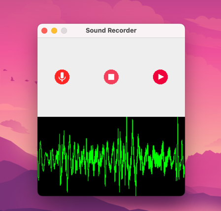

# Sound Recorder

Simple and functional sound recorder written in Java. Allows you to record and play any sound.

## System Requirements
1. Java 17 & above
2. Microphone Access

## How to Run?
``./gradlew run``

## How to Build?
``./gradlew shadowJar``

## How to Distribute
Share the ``SoundRecorder.jar`` file in ``app/build/libs/SoundRecorder.jar``

## Future improvements
1. Save audio to a file
2. Play audio from file
